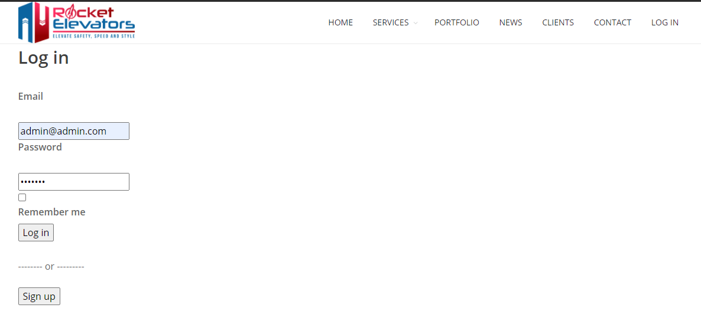

# Rocket Elevators Information System 

# Week 9

If more informations is needed on database and basic operation of our Web App please refer to Week 4 and Week 5's Readme at https://github.com/officialmxm/Rocket_Elevators_Information_System


 - 📚 Instructions to acces to the admin panel:

```



This week we are implementing API's to our web app. Here are the API's weve implemented this week. We also started working ENVIRONEMENTS using the gem FIGARO and the application.yml file.

- Google Maps
- Twilio
- Slack
- Dropbox
- Sendgrid
- IBM Watson
- Zendesk

Also we will show you the following updates
- Gems added
- API's
- Routes
- URL for our site dduquette.xyz
- Team


### 1 - Gems Added this week 
* gem 'devise'
      https://github.com/heartcombo/devise

* gem 'rails-admin'
      https://github.com/sferik/rails_admin/


- to connect to your postgresql DB you nees to start it with this command line: 
**sudo service postgresql start/stop/status**# Rocket Elevators Information System 


This week we are implementing API's to our web app. Here are the API's weve implemented this week. We also started working ENVIRONEMENTS using the gem FIGARO and the application.yml file.

- Google Maps
- Twilio
- Slack
- Dropbox
- Sendgrid
- IBM Watson
- Zendesk

Also we will show you the following updates
- Gems added
- API's
- Routes
- URL for our site https://dduquette.xyz
- 


### 1 - Gems Added this week 
* gem 'devise'
      https://github.com/heartcombo/devise

* gem 'rails-admin'
      https://github.com/sferik/rails_admin/

* gem 'devise'
      https://github.com/heartcombo/devise

* gem 'rails-admin'
      https://github.com/sferik/rails_admin/

* gem 'devise'
      https://github.com/heartcombo/devise

* gem 'rails-admin'
      https://github.com/sferik/rails_admin/


### 2 - Google Map

With our google account we log int the console.cloud.google where we ll set a google API key and enables service that we will need , copy the key and save it.


### 2 - Google Map

With our google account we log int the console.cloud.google where we ll set a google API key and enables service that we will need , copy the key and save it.


my REST API collection of end points:  https://www.getpostman.com/collections/d994f00ccdfc98b9224d

my rest api git hub: https://github.com/Dna1444/Rest_Api

my graphQL git hub: https://github.com/Dna1444/GraphQl_Api


read me created by Dana Duquette


